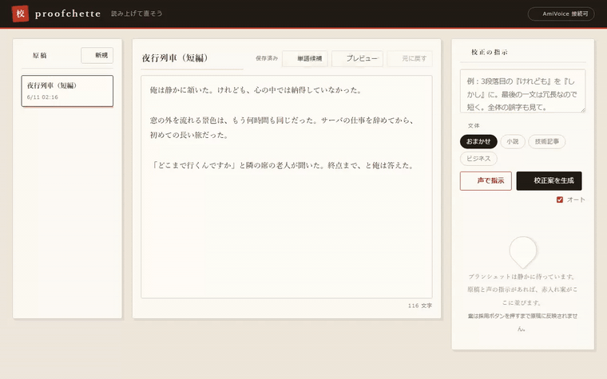

# proofchette — 読み上げて直そう

> 声で赤入れする校正ツール（proof + planchette）



誤字脱字を見つける一番確実な方法は、昔から音読です。読み上げていると、誤字につまずくだけでなく
「ここはこうしたい」が次々と口をついて出てきます。proofchette は、その口をついて出た言葉を
そのまま赤入れにするツールです。原稿を**読み上げる → 思いついたら話す → 直す**が、ブラウザの一画面で回ります。

AmiVoice が声を文字に起こし、その指示を Claude が解釈して原稿への赤入れ案（修正前→修正後＋理由）を作ります。
案はあくまで「案」として並ぶだけで、**採用ボタンを押すまで原稿は一切変わりません**。

名前は proof（校正刷り）+ planchette（ウィジャ盤で文字を指し示す盤）から。赤入れ案に触れると
原稿の該当箇所をハイライトが指し示す動きが、そのままプランシェットになっています。
小説・技術記事・ビジネス文書のいずれにも使えます。

## 仕組み（二層構成）

```
 声の指示 ──[AmiVoice 同期HTTP]──▶ 指示テキスト
                                        │
 原稿 ──────────────────────────────────┼──[Claude]──▶ 赤入れ案(before/after/理由)
                                                          │
                                              採用チェック → 原稿へ反映
```

- 第1層: AmiVoice が「どう直したいか」の発話を高精度に文字化
- 第2層: Claude が原稿と指示を突き合わせ、実際の編集（置換）に落とし込む

声＝指示の入力、原稿＝直す対象、と役割を分けているので、原稿を音声で汚さずに済みます。

## 画面構成（3ペイン）

- 左: 原稿一覧（複数原稿を保存・管理。新規・選択・リネーム・削除・サンプル原稿）
- 中央: エディタ（自動保存、Markdown プレビュー切替、読み上げ＝耳校正、採用履歴、元に戻す）
- 右: 校正（声の指示 → 文体プリセット → 校正案 → 採用して反映）

初めて試すときは、左下の「サンプル原稿で試す」を押すと誤字入りの短い原稿が入ります。

### プランシェット・ハイライト

赤入れ案にカーソルを乗せると、**原稿の該当箇所までハイライトが滑っていき、朱色で指し示します**。
ウィジャ盤のプランシェットが文字を指すように、案と原稿の対応がひと目で分かります。
採用した瞬間は、直った箇所が一拍だけ緑に光ります。

### 文体プリセット

「おまかせ / 小説 / 技術記事 / ビジネス」を選ぶと、Claude の校正方針が切り替わります。
小説なら作者の文体を尊重して控えめに、技術記事なら表記ゆれの統一と簡潔化を積極的に、
ビジネスなら敬語の正確さを重視します。

原稿はサーバ側の `manuscripts/` に `.md` で保存されます。SQLite を使わずファイルにしているのは、
原稿を直接開ける・Git で管理できる・バックアップしやすいためです。Web 公開はせず自分のマシンで使う前提です。

## セットアップ

```bash
pip install -r requirements.txt
cp .env.example .env   # 下記2つのキーを記入
python app.py
```

ブラウザで http://127.0.0.1:5050 を開きます（Windows でポート 5000 が予約レンジに当たるため既定は 5050。環境変数 `PORT` で変更可）。

| 変数 | 用途 |
| --- | --- |
| `AMIVOICE_APP_KEY` | AmiVoice Cloud Platform のマイページで取得する APPKEY |
| `AMIVOICE_PROFILE_ID` | 単語の登録先・認識で使うプロファイル ID（マイページ辞書なら `:サービスID`） |
| `ANTHROPIC_API_KEY` | 校正案・単語候補の生成に使う Claude の API キー（設定すると優先） |
| `OPENAI_API_KEY` | Claude キーが無いときの代替。OpenAI（既定 `gpt-4o`）で校正する |
| `PROOFREAD_MODEL` | （任意）Anthropic で校正に使うモデル。既定は `claude-sonnet-4-6` |
| `OPENAI_MODEL` | （任意）OpenAI で校正に使うモデル。既定は `gpt-4o` |

> 校正の頭脳は **`ANTHROPIC_API_KEY` があればそちらを優先**し、無ければ `OPENAI_API_KEY` を使います。どちらか一方あれば動きます。
>
> AmiVoice キーが未設定でも、指示を手入力すれば校正機能は動きます（声の部分だけ無効）。

## 使い方

1. 左の「新規」で原稿を作成し、中央のエディタに書く（または貼り付け）。入力すると自動保存されます。
2. 原稿を読み上げながら、直したくなったら**スペースキーを押している間だけ話します**（離すとそこで一区切り、すぐ認識へ）。「声で指示」ボタンでもトグル録音できます（例:「3段落目の『けれども』を『しかし』に。最後の一文は冗長だから短く」）。スペースは入力欄の外にフォーカスがあるときだけ録音になります。
   録音中はマイクの入力レベルがバーで表示され、2.5秒以上無音が続くと「声が入っていないようです」と知らせます。
3. **オート（既定でオン）**: 認識が終わるとそのまま校正案を生成し、指示欄はクリアされて次の発話を待ちます。指示を目で確認してから生成したい場合はオートを外してください。
4. 右に赤入れ案が並びます。**未採用の案は消えず、新しい案が上に積まれていきます。**各案には種類タグ（誤字脱字/表記ゆれ/文体/冗長）と変更箇所の強調が付きます。「この修正を適用」「採用分を適用」、または**数字キー 1〜9** で反映、**U** でひとつ前に戻す。**採用するまで原稿は変わりません。**
5. 「元に戻す」でひとつ前の原稿に。「履歴」には適用のたびに適用直前の原稿が自動で残り、任意の時点へ巻き戻し・編集ログのMarkdown書き出しができます。

### ハンズフリー

「ハンズフリー」にチェックすると、マイクを開きっぱなしにして**話し終わり（約1.5秒の無音）で自動的に一区切り**して認識します。スペースキーすら押さず、原稿を読み上げながら直せます。

### 耳校正（読み上げ）

「読み上げ」ボタンで、ブラウザの音声合成が原稿を一文ずつ読み上げ、読んでいる文をハイライトで追いかけます。耳で聞くと黙読で滑る誤字に気づけます。読み上げ中にスペースで指示を話すと読み上げは自動で一時停止し、認識が終わると再開します（ハンズフリーとの併用は、読み上げ音声をマイクが拾うため不可）。

## 音声認識の単語登録

固有名詞や専門用語は AmiVoice が誤変換しがちです。エディタ上部の「単語候補」を押すと、原稿を Claude が読み、登録した方がよい語を**読み付き**で一覧にします。

1. 登録したい語にチェック（読みは必要なら各行で修正）。
2. 「選択分を登録」を押すと、そのまま AmiVoice のプロファイルに登録されます。
3. 登録後の修正・削除は AmiVoice のマイページでできます。

登録には `AMIVOICE_PROFILE_ID` の設定が必要です（未設定なら登録ボタンは無効）。マイページ辞書を使う場合は `:サービスID`、独自プロファイルなら半角英数・`-`・`_` で任意の名前を指定します。認識時にも同じプロファイルが使われるので、登録した語はすぐ認識に反映されます。

> AmiVoice のユーザー辞書 API は「送った単語で総入れ替え」になるため、ツールは登録前に現在の単語を取得してマージし、既存を壊さないようにしています。読みが極端に短い語（1〜2文字）は誤登録のもとになるため Claude 側でも絞り込んでいます。クラスは省略しています（汎用エンジンでは任意。氏名・住所エンジンのみ必須）。

> `.txt 保存` は、手動でマイページにアップロードしたいとき向けのフォールバックです（「表記［タブ］読み」形式）。

## ファイル構成

```
app.py                 Flask ルーティング（校正API + 原稿管理API）
storage.py             原稿のファイル保存・管理（manuscripts/ に .md）
amivoice.py            AmiVoice の音声認識・単語登録ラッパー
claude_proofreader.py  原稿＋指示 → 校正案、原稿 → 単語登録候補 の生成
templates/index.html   画面（3ペイン）
static/app.js          原稿管理・録音・生成・適用のロジック
static/style.css       スタイル
manuscripts/           原稿の保存先（自動生成）
```

## 設計上の注意・割り切り

- 録音は WebM（ブラウザの MediaRecorder）。短い発話想定で同期HTTPを採用。長時間音声を扱うなら非同期HTTP/WebSocketへ差し替えが必要です。
- ログ保存なしのエンドポイント（`/v1/nolog/recognize`）を使用。ログを残してよい場合は `amivoice.py` で切り替えます。
- 校正案の適用は「最初の一致のみ置換」。同じ文字列が複数あるときの取り違えを防ぐためで、必要なら手動でご確認ください。
- 原稿 ID は uuid の hex のみ許可（パストラバーサル防止）。ローカル運用前提のため認証等は持たせていません。

## 拡張のたねメモ

- 登録済み単語の一覧表示・削除を画面から管理（現在は登録のみ）
- 原稿の全文 Markdown エクスポート／インポート
- 耳校正の声を VOICEVOX などの自然な音声に差し替え
